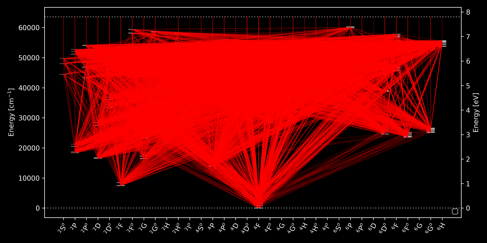

# formato3

Tool to build model atoms in the MULTI input format, required in non-LTE calculations of chemical abundances.


There are 3 main scripts: **formato.py**, **mergato.py** and **plotato.py**, and an additional fortran code to make superatom in **msa/v5/make_superatom_v5.f** (from B. Plez).

The model atoms in the directory `atoms/Co` are computed using the examples provided below and using atomic data from the directories `ad/vald/Co`.

Many parameters are available at the begining of the `formato.py` file.

If a new model atom want to be build, it requires to complete dictionaries (`ion_el`, `ion_g`, `ion_cfg`, `ion_term`, `mass` and `abund`) at the begining of the same file.

---

## Build model atom by ionization stage

```
formato.py input_filename [output_filename]
```

Examples:

```
formato.py ad/vald/Co/I/ThibaultMerle.047560 atom.Co1
```
```
formato.py ad/vald/Co/II/ThibaultMerle.047578 atom.Co2
```

/!\ The number of lines (**NLIN** parameter) may be updated at the beginning of the model atom /!\

---

## Build model atom by combining two ionization stages

```
mergato.py atom1 atom2
```

Example: 

mergato.py atom.Co1 atom.Co2

---

## Make a super-atom by combining levels and lines

This relies on the fortran code from B. Plez, slightly modified msa/v5/make_superatom_v5.f

First compile it:

```
gfortran -o msa make_superatom_v5.f
```

It can work with one ionization degree or two at a time.

Example:
```
$ msa 
Full atom input file (MULTI format):
atom.Co12
Super atom output file:
superatom.Co12
Do not merge levels below this energy (cm-1):
10000
Minimum energy range for super-levels (cm-1):
1000
Typical temperature for the use of the superatom
  This T will be used to compute partition functions
  within superlevels, and to estimate gamma6
6000
```
It is also possible to use *here documents*:

```
msa <<EOF
> atom.Co2
> superatom.Co2
> 10000
> 1000
> 6000
> EOF
```
---

## Control plots of the model atoms

```
plotato.py atom1
```

can produce Grotrian diagrams for energy levels `atom.XXY_elY.png`, radiative transitions `atom.XXY_rtY.png` and photoionization `atom.XXY_pxY.png`. 

In addition, a histogram of the log*gf* can also be obtained `atom.XXY_gf.png`. 

Example:

```
plotato.py atom.Co1
```

Grotrian diagram with photoionisations of Co I:


Grotrian diagram with all the radiative transitions of Co I:



Histogram of the oscillator strenghts of Co I:


---

Please cite this webpage and [Merle et al. (2011)](#https://ui.adsabs.harvard.edu/abs/2011MNRAS.418..863M/abstract) if you find this tool useful.

Bugs can be reported to tmerle@ulb.ac.be .
